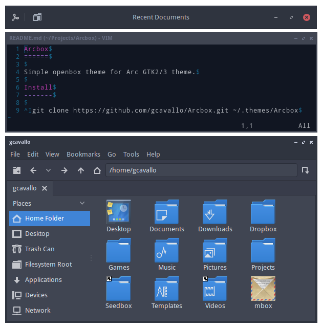

Arcbox
======

Simple openbox theme for [Arc GTK2/3 theme](https://github.com/horst3180/Arc-theme).

Install
-------

**Obconf**

Download `Arcbox.obt` file from releases and open it with Obconf

**User-specific**

	git clone https://github.com/gcavallo/Arcbox.git ~/.themes/Arcbox

**System-wide**

	sudo git clone https://github.com/gcavallo/Arcbox.git /usr/share/themes/Arcbox

**Arch Linux**

[Arch User Repository](https://aur.archlinux.org/packages/openbox-theme-arcbox/)

License
-------

GPLv3

See LICENSE.txt file included, or https://www.gnu.org/licenses/gpl.txt
